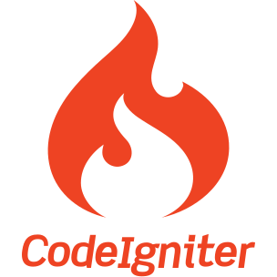
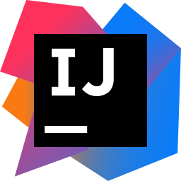
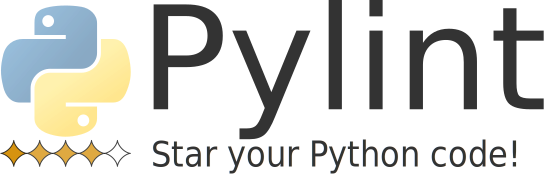

<div id="top-bar" align="center">
    <h3>Hi there , my name is Prince</h3>
    <h4>I am an aspiring Full-Stack Developer!</h4>
     
    
    <br>
    
    
    <a href="https://princevelasco.com/" target="_blank">
        
    </a>
</div>

- 🔭 I’m currently working on APIs! 
- 🌱 I’m currently learning Python, Vue, and Fullstack development!
- 👯 I'm looking to collaborate on full-stack web apps!
- 💬 Ask me about anything Python and Vue
- 📫 Connect with me on: [**LinkedIn**][linkedin-url]

## 📊 Github stats

<details> 
    <summary>:octocat: GitHub Profile Stats</summary>
    <br/>
    <p align="center">
        
         &nbsp;&nbsp;
        
    </p>
</details>

<!--START_SECTION:activity-->
1. 🗣 Commented on [#407](https://github.com/aapatre/Automatic-Udemy-Course-Enroller-GET-PAID-UDEMY-COURSES-for-FREE/issues/407) in [aapatre/Automatic-Udemy-Course-Enroller-GET-PAID-UDEMY-COURSES-for-FREE](https://github.com/aapatre/Automatic-Udemy-Course-Enroller-GET-PAID-UDEMY-COURSES-for-FREE)
2. 🎉 Merged PR [#330](https://github.com/PrynsTag/oneBarangay-REST-API/pull/330) in [PrynsTag/oneBarangay-REST-API](https://github.com/PrynsTag/oneBarangay-REST-API)
3. 🗣 Commented on [#21](https://github.com/benphelps/homepage-docs/issues/21) in [benphelps/homepage-docs](https://github.com/benphelps/homepage-docs)
4. 🗣 Commented on [#21](https://github.com/benphelps/homepage-docs/issues/21) in [benphelps/homepage-docs](https://github.com/benphelps/homepage-docs)
5. 💪 Opened PR [#21](https://github.com/benphelps/homepage-docs/pull/21) in [benphelps/homepage-docs](https://github.com/benphelps/homepage-docs)
<!--END_SECTION:activity-->

## 📊 WakaTime Stats
<details>
    <summary>:clock1: WakaTime Coding Hours Stats</summary>
    <br/>
    <p align="center">
        
    </p>
</details>

<!--START_SECTION:waka-->


**I'm an Early 🐤** 

```text
🌞 Morning                164 commits         ███████░░░░░░░░░░░░░░░░░░   27.33 % 
🌆 Daytime                143 commits         ██████░░░░░░░░░░░░░░░░░░░   23.83 % 
🌃 Evening                219 commits         █████████░░░░░░░░░░░░░░░░   36.50 % 
🌙 Night                  74 commits          ███░░░░░░░░░░░░░░░░░░░░░░   12.33 % 
```
📅 **I'm Most Productive on Wednesday** 

```text
Monday                   61 commits          ███░░░░░░░░░░░░░░░░░░░░░░   10.17 % 
Tuesday                  71 commits          ███░░░░░░░░░░░░░░░░░░░░░░   11.83 % 
Wednesday                116 commits         █████░░░░░░░░░░░░░░░░░░░░   19.33 % 
Thursday                 79 commits          ███░░░░░░░░░░░░░░░░░░░░░░   13.17 % 
Friday                   106 commits         ████░░░░░░░░░░░░░░░░░░░░░   17.67 % 
Saturday                 71 commits          ███░░░░░░░░░░░░░░░░░░░░░░   11.83 % 
Sunday                   96 commits          ████░░░░░░░░░░░░░░░░░░░░░   16.00 % 
```


📊 **This Week I Spent My Time On** 

```text
🕑︎ Time Zone: Asia/Manila

💬 Programming Languages: 
Python                   1 hr 38 mins        ███████████████░░░░░░░░░░   59.37 % 
HTML                     41 mins             ██████░░░░░░░░░░░░░░░░░░░   24.99 % 
JSON                     12 mins             ██░░░░░░░░░░░░░░░░░░░░░░░   07.43 % 
Text                     6 mins              █░░░░░░░░░░░░░░░░░░░░░░░░   03.96 % 
GitIgnore file           3 mins              █░░░░░░░░░░░░░░░░░░░░░░░░   02.39 % 

🔥 Editors: 
PyCharm                  2 hrs 10 mins       ████████████████████░░░░░   78.44 % 
VS Code                  35 mins             █████░░░░░░░░░░░░░░░░░░░░   21.56 % 

🐱‍💻 Projects: 
scrapyClassCentral       1 hr 46 mins        ████████████████░░░░░░░░░   64.21 % 
princevelasco            34 mins             █████░░░░░░░░░░░░░░░░░░░░   21.01 % 
Udemy-Enroller           19 mins             ███░░░░░░░░░░░░░░░░░░░░░░   11.66 % 
Unknown Project          4 mins              █░░░░░░░░░░░░░░░░░░░░░░░░   02.78 % 
etc                      0 secs              ░░░░░░░░░░░░░░░░░░░░░░░░░   00.35 % 

💻 Operating System: 
Windows                  2 hrs 11 mins       ████████████████████░░░░░   78.99 % 
Linux                    34 mins             █████░░░░░░░░░░░░░░░░░░░░   21.01 % 
```

**I Mostly Code in Swift** 

```text
HTML                     12 repos            ████░░░░░░░░░░░░░░░░░░░░░   14.29 % 
Java                     6 repos             ██░░░░░░░░░░░░░░░░░░░░░░░   07.14 % 
JavaScript               3 repos             █░░░░░░░░░░░░░░░░░░░░░░░░   03.57 % 
Shell                    1 repo              ░░░░░░░░░░░░░░░░░░░░░░░░░   01.19 % 
Dockerfile               1 repo              ░░░░░░░░░░░░░░░░░░░░░░░░░   01.19 % 
```


 Last Updated on 27/02/2023 01:00:24 UTC
<!--END_SECTION:waka-->

## 🛠️ My Favorite Tools & Technology

<details>
<summary>:computer: Programming Languages and Tools that I Use</summary>
<table>
<thead>
  <tr>
    <th>Categories</th>
    <th colspan="5">Technology</th>
  </tr>
</thead>
<tbody align="center">
  <tr>
    <td>Programming Language</td>
    <td>
        
        <br>Python
    </td>
    <td>
        
        <br>JavaScript
    </td>
    <td>
        
        <br>Kotlin
    </td>
    <td>
        
        <br>PHP
    </td>
    <td>
        
        <br>Swift
    </td>
  </tr>
  <tr>
    <td>Libraries</td>
    <td>
        
        <br>Numpy
    </td>
    <td>
        
        <br>Pandas
    </td>
    <td>
        
        <br>Matplotlib
    </td>
    <td>
        
        <br>Scikit-Learn
    </td>
    <td>
        
        <br>Scrapy
    </td>
  </tr>
  <tr>
    <td>Front-End Technologies</td>
    <td>
        
        <br>Sass
    </td>
    <td>
        
        <br>Bootstrap
    </td>
    <td>
        
        <br>Tailwind
    </td>
    <td>
        
        <br>JavaScript
    </td>
    <td>
        
        <br>Vue
    </td>
  </tr>
  <tr>
    <td>Back-End Technologies</td>
    <td>
        
        <br>Django
    </td>
    <td>
        
        <br>CodeIgniter
    </td>
    <td></td>
    <td></td>
    <td></td>
  </tr>
  <tr>
    <td>Database</td>
    <td>
        
        <br>SQLite
    </td>
    <td>
        
        <br>MySQL
    </td>
    <td>
        
        <br>PostgreSQL
    </td>
    <td>
        
        <br>Firestore
    </td>
    <td>
        
        <br>Redis
    </td>
  </tr>
  <tr>
    <td>Cloud Hosting</td>
    <td>
        
        <br>GCP
    </td>
    <td>
        
        <br>AWS
    </td>
    <td>
        
        <br>Azure
    </td>
    <td>
        
        <br>Heroku
    </td>
    <td></td>
  </tr>
  <tr>
    <td rowspan="4">Software & Tools</td>
    <td>
        
        <br>Git
    </td>
    <td>
        
        <br>Jira
    </td>
    <td>
        
        <br>Pre-commit
    </td>
    <td>
        
        <br>Pycharm
    </td>
    <td>
        
        <br>Android Studio
    </td>
  </tr>
  <tr>
    <td>
        
        <br>Notion
    </td>
    <td>
        
        <br>Ubuntu
    </td>
    <td>
        
        <br>MacOS
    </td>
    <td>
        
        <br>Windows
    </td>
    <td>
        
        <br>Figma
    </td>
  </tr>
  <tr>
    <td>
        
        <br>IntelliJ IDEA
    </td>
    <td>
        
        <br>Webpack
    </td>
    <td>
        
        <br>CircleCI
    </td>
    <td>
        
        <br>TravisCI
    </td>
    <td>
        
        <br>Github Actions
    </td>
  </tr>
  <tr>
    <td>
        
        <br>Github
    </td>
    <td>
        
        <br>Jupyter Notebook
    </td>
    <td>
        
        <br>Mypy
    </td>
    <td>
        
        <br>PIP
    </td>
    <td>
        
        <br>Postman
    </td>
  </tr>
  <tr>
    <td>Linters & Code Formatters</td>
    <td>
        
        <br>ESlint
    </td>
    <td>
        
        <br>Stylelint
    </td>
    <td>
        
        <br>Pylint
    </td>
    <td>
        Flake8
    </td>
    <td>
        
        <br>Black
    </td>
  </tr>
</tbody>
</table>
</details>

---

<div align="center">
    <h3>🏭 Hire me</h3>
    <a href="https://www.linkedin.com/in/princevelasco/">
        
    </a>
    <a href="https://angel.co/u/prynstag/">
        
    </a>
    <a href="https://my.indeed.com/p/princecarlv-rnxqsk8">
        
    </a>
    <br>
    <a href="https://twitter.com/PrynsTag">
        
    </a>
    <a href="mailto:github@princevelasco.com?subject= Just Want to Reach Out!">
        
    </a>
</div>

---

<div align="center">
    <h3>:point_right: Support Me</h3>
    <p>
        <a href="https://www.buymeacoffee.com/PrynsTag" target="_blank">
            
        </a>
        <a href="https://www.paypal.com/donate/?hosted_button_id=HRJXYEAC4VVEY">
            
        </a>
        <a href="https://www.patreon.com/prynstag">
            
        </a>
        <a href="https://ko-fi.com/prynstag">
            
        </a>
    </p>
</div>

---

<!-- MARKDOWN LINKS & IMAGES -->
<!-- https://www.markdownguide.org/basic-syntax/#reference-style-links -->
[linkedin-url]: https://www.linkedin.com/in/princevelasco/
[linkedin-shield]: https://img.shields.io/badge/LinkedIn-0077B5?style=for-the-badge&logo=linkedin&logoColor=white

[codewars-url]: https://www.codewars.com/users/PrynsTag
[codewars-shield]: https://img.shields.io/badge/Codewars-B1361E?style=for-the-badge&logo=Codewars&logoColor=white

[bitbucket-url]: https://bitbucket.org/PrynsTag/
[bitbucket-shield]: https://img.shields.io/badge/Bitbucket-0747a6?style=for-the-badge&logo=bitbucket&logoColor=white

[hackerrank-url]: https://www.hackerrank.com/PrynsTag
[hackerrank-shield]: https://img.shields.io/badge/-Hackerrank-2EC866?style=for-the-badge&logo=HackerRank&logoColor=white

[github-url]: https://github.com/PrynsTag
[github-shield]: https://img.shields.io/badge/GitHub-100000?style=for-the-badge&logo=github&logoColor=white

[kaggle-url]: https://www.kaggle.com/princecarlvelasco
[kaggle-shield]: https://img.shields.io/badge/Kaggle-20BEFF?style=for-the-badge&logo=Kaggle&logoColor=white

[stackoverflow-url]: https://stackoverflow.com/users/11668142/prynstag
[stackoverflow-shield]: https://img.shields.io/badge/Stack_Overflow-FE7A16?style=for-the-badge&logo=stack-overflow&logoColor=white

[banner-url]: https://github.com/PrynsTag/PrynsTag/blob/master/banner_illustration.png
[banner-author-url]: https://dribbble.com/shots/7250175-Manage-your-own-task

[github-stats-url]: https://github-readme-stats.vercel.app/api?username=PrynsTag&show_icons=true&theme=merko
[github-top-lang-url]: https://github-readme-stats.vercel.app/api/top-langs/?username=PrynsTag&layout=compact&theme=merko&hide=html,jupyter%20notebook
[streak-stats-url]: https://github-readme-streak-stats.herokuapp.com/?user=PrynsTag&theme=merko

[profile-views-url]: https://gpvc.arturio.dev/PrynsTag?color=red
[profile-views-shield]: https://img.shields.io/badge/Visitors-172B4D?style=for-the-badge&logo=Opsgenie&logoColor=white

[twitter-url]: https://twitter.com/PrynsTag
[twitter-shield]: https://img.shields.io/badge/Twitter-1DA1F2?style=for-the-badge&logo=twitter&logoColor=white

<!-- Programming Language Shields -->
[python-shield]: https://img.shields.io/badge/Python-FFD43B?style=for-the-badge&logo=python&logoColor=darkgreen
[html-shield]: https://img.shields.io/badge/HTML5-E34F26?style=for-the-badge&logo=html5&logoColor=white
[css-shield]: https://img.shields.io/badge/CSS3-1572B6?style=for-the-badge&logo=css3&logoColor=white
[js-shield]: https://img.shields.io/badge/JavaScript-323330?style=for-the-badge&logo=javascript&logoColor=F7DF1E
[php-shield]: https://img.shields.io/badge/PHP-777BB4?style=for-the-badge&logo=php&logoColor=white
[swift-shield]: https://img.shields.io/badge/Swift-FA7343?style=for-the-badge&logo=swift&logoColor=white
[kotlin-shield]: https://img.shields.io/badge/Kotlin-0095D5?&style=for-the-badge&logo=kotlin&logoColor=white
[sklearn-shield]: https://img.shields.io/badge/scikit_learn-F7931E?style=for-the-badge&logo=scikit-learn&logoColor=white
[numpy-shield]: https://img.shields.io/badge/Numpy-777BB4?style=for-the-badge&logo=numpy&logoColor=white
[pandas-shield]: https://img.shields.io/badge/Pandas-2C2D72?style=for-the-badge&logo=pandas&logoColor=white
[json-shield]: https://img.shields.io/badge/json-5E5C5C?style=for-the-badge&logo=json&logoColor=white
<!-- Database Shields -->
[mysql-shield]: https://img.shields.io/badge/MySQL-005C84?style=for-the-badge&logo=mysql&logoColor=white
[postgre-shield]: https://img.shields.io/badge/PostgreSQL-316192?style=for-the-badge&logo=postgresql&logoColor=white
[sqlite-shield]: https://img.shields.io/badge/SQLite-07405E?style=for-the-badge&logo=sqlite&logoColor=white
[redis-shield]: https://img.shields.io/badge/redis-%23DD0031.svg?&style=for-the-badge&logo=redis&logoColor=white
<!-- Frameworks Shields -->
[firebase-shield]: https://img.shields.io/badge/firebase-ffca28?style=for-the-badge&logo=firebase&logoColor=black
[npm-shield]: https://img.shields.io/badge/npm-CB3837?style=for-the-badge&logo=npm&logoColor=white
[sass-shield]: https://img.shields.io/badge/Sass-CC6699?style=for-the-badge&logo=sass&logoColor=white
[jupyter-shield]: https://img.shields.io/badge/Jupyter-F37626.svg?&style=for-the-badge&logo=Jupyter&logoColor=white
[markdown-shield]: https://img.shields.io/badge/Markdown-000000?style=for-the-badge&logo=markdown&logoColor=white
[bash-shield]: https://img.shields.io/badge/Shell_Script-121011?style=for-the-badge&logo=gnu-bash&logoColor=white
[vue-shield]: https://img.shields.io/badge/Vue.js-35495E?style=for-the-badge&logo=vuedotjs&logoColor=4FC08D
[tailwind-shield]: https://img.shields.io/badge/Tailwind_CSS-38B2AC?style=for-the-badge&logo=tailwind-css&logoColor=white
[bootstrap-shield]: https://img.shields.io/badge/Bootstrap-563D7C?style=for-the-badge&logo=bootstrap&logoColor=white
[jquery-shield]: https://img.shields.io/badge/jQuery-0769AD?style=for-the-badge&logo=jquery&logoColor=white
[django-shield]: https://img.shields.io/badge/Django-092E20?style=for-the-badge&logo=django&logoColor=green
[drf-shield]: https://img.shields.io/badge/DJANGO-REST-ff1709?style=for-the-badge&logo=django&logoColor=white&color=ff1709&labelColor=gray
[CI-shield]: https://img.shields.io/badge/Codeigniter-EF4223?style=for-the-badge&logo=codeigniter&logoColor=white
[postman-shield]: https://img.shields.io/badge/Postman-FF6C37?style=for-the-badge&logo=Postman&logoColor=white
[selenium-shield]: https://img.shields.io/badge/Selenium-43B02A?style=for-the-badge&logo=Selenium&logoColor=white
[chartjs-shield]: https://img.shields.io/badge/Chart.js-FF6384?style=for-the-badge&logo=chartdotjs&logoColor=white
[xampp-shield]: https://img.shields.io/badge/Xampp-F37623?style=for-the-badge&logo=xampp&logoColor=white
[gitkraken-shield]: https://img.shields.io/badge/GitKraken-179287?style=for-the-badge&logo=GitKraken&logoColor=white
[cocoapods-shield]: https://img.shields.io/badge/cocoapods-FA2A02?style=for-the-badge&logo=cocoapods&logoColor=white
[gradle-shield]: https://img.shields.io/badge/gradle-02303A?style=for-the-badge&logo=gradle&logoColor=white
[webpack-shield]: https://img.shields.io/badge/Webpack-8DD6F9?style=for-the-badge&logo=Webpack&logoColor=white
<!-- Workflow Platforms Shields -->
[jira-shield]: https://img.shields.io/badge/Jira-0052CC?style=for-the-badge&logo=Jira&logoColor=white
<!-- Cloud Shields -->
[aws-shield]: https://img.shields.io/badge/Amazon_AWS-232F3E?style=for-the-badge&logo=amazon-aws&logoColor=white
[gcs-shield]: https://img.shields.io/badge/Google_Cloud-4285F4?style=for-the-badge&logo=google-cloud&logoColor=white
[azure-shield]: https://img.shields.io/badge/microsoft%20azure-0089D6?style=for-the-badge&logo=microsoft-azure&logoColor=white
[heroku-shield]: https://img.shields.io/badge/Heroku-430098?style=for-the-badge&logo=heroku&logoColor=white
[actions-shield]: https://img.shields.io/badge/GitHub_Actions-2088FF?style=for-the-badge&logo=github-actions&logoColor=white
[travis-shield]: https://img.shields.io/badge/travis_CI-3EAAAF?style=for-the-badge&logo=travisci&logoColor=white
[circleci-shield]: https://img.shields.io/badge/circleci-343434?style=for-the-badge&logo=circleci&logoColor=white
<!-- Web Browsers Shields -->
[chrome-shield]: https://img.shields.io/badge/Google_chrome-4285F4?style=for-the-badge&logo=Google-chrome&logoColor=white
[firefox-shield]: https://img.shields.io/badge/Firefox_Browser-FF7139?style=for-the-badge&logo=Firefox-Browser&logoColor=white
[opera-shield]: https://img.shields.io/badge/Opera-FF1B2D?style=for-the-badge&logo=Opera&logoColor=white
[brave-shield]: https://img.shields.io/badge/Brave-FF1B2D?style=for-the-badge&logo=Brave&logoColor=white
<!-- OS Shields -->
[ubuntu-shield]: https://img.shields.io/badge/Ubuntu-E95420?style=for-the-badge&logo=ubuntu&logoColor=white
[android-shield]: https://img.shields.io/badge/Android-3DDC84?style=for-the-badge&logo=android&logoColor=white
[windows-shield]: https://img.shields.io/badge/Windows-0078D6?style=for-the-badge&logo=windows&logoColor=white
[mac-shield]: https://img.shields.io/badge/mac%20os-000000?style=for-the-badge&logo=apple&logoColor=white
<!-- IDE Shields -->
[xcode-shield]: https://img.shields.io/badge/Xcode-007ACC?style=flat-square&logo=Xcode&logoColor=white
[vscode-shield]: https://img.shields.io/badge/Visual_Studio_Code-0078D4?style=for-the-badge&logo=visual%20studio%20code&logoColor=white
[pycharm-shield]: https://img.shields.io/badge/pycharm-143?style=for-the-badge&logo=pycharm&logoColor=black&color=black&labelColor=green
[phpstorm-shield]: https://img.shields.io/badge/phpstorm-143?style=for-the-badge&logo=phpstorm&logoColor=black&color=black&labelColor=darkorchid
[intellij-shield]: https://img.shields.io/badge/IntelliJIDEA-000000.svg?style=for-the-badge&logo=intellij-idea&logoColor=white
[android-studio-shield]: https://img.shields.io/badge/Android_Studio-3DDC84?style=for-the-badge&logo=android-studio&logoColor=white
<!-- Office Shields -->
[notion-shield]: https://img.shields.io/badge/Notion-000000?style=for-the-badge&logo=notion&logoColor=white
[trello-shield]: https://img.shields.io/badge/Trello-0052CC?style=for-the-badge&logo=trello&logoColor=white
<!-- Design Shields -->
[figma-shield]: https://img.shields.io/badge/Figma-F24E1E?style=for-the-badge&logo=figma&logoColor=white
[canva-shield]: https://img.shields.io/badge/Canva-%2300C4CC.svg?&style=for-the-badge&logo=Canva&logoColor=white
<!-- Education Shields -->
[udemy-shield]: https://img.shields.io/badge/Udemy-EC5252?style=for-the-badge&logo=Udemy&logoColor=white
[khan-shield]: https://img.shields.io/badge/Khan%20Academy-14BF96?style=for-the-badge&logo=Khan%20Academy&logoColor=white
[pluralsight-shield]: https://img.shields.io/badge/Pluralsight-F15B2A?style=for-the-badge&logo=Pluralsight&logoColor=white
[coursera-shield]: https://img.shields.io/badge/Coursera-0056D2?style=for-the-badge&logo=Coursera&logoColor=white
[udacity-shield]: https://img.shields.io/badge/Udacity-grey?style=for-the-badge&logo=udacity&logoColor=#5FCFEE
[fcc-shield]: https://img.shields.io/badge/free%20code%20camp-27273D?style=for-the-badge&logo=freecodecamp&logoColor=white
[skillshare-shield]: https://img.shields.io/badge/skill%20share-002333?style=for-the-badge&logo=skillshare&logoColor=white
[edx-shield]: https://img.shields.io/badge/Edx-193A3E?style=for-the-badge&logo=edx&logoColor=white
[datacamp-shield]: https://img.shields.io/badge/Datacamp-05192D?style=for-the-badge&logo=datacamp&logoColor=65FF8F
[mdn-shield]: https://img.shields.io/badge/MDN_Web_Docs-black?style=for-the-badge&logo=mdnwebdocs&logoColor=white
<!-- Linter Shields -->
[eslint-shield]: https://img.shields.io/badge/eslint-3A33D1?style=for-the-badge&logo=eslint&logoColor=white
[prettier-shield]: https://img.shields.io/badge/prettier-1A2C34?style=for-the-badge&logo=prettier&logoColor=F7BA3E
[stylelint-shield]: https://img.shields.io/badge/stylelint-000?style=for-the-badge&logo=stylelint&logoColor=white
[stylelint-shield]: https://img.shields.io/badge/stylelint-000?style=for-the-badge&logo=stylelint&logoColor=white
<!-- Terminal Shields -->
[gnu-shield]: https://img.shields.io/badge/GNU%20Bash-4EAA25?style=for-the-badge&logo=GNU%20Bash&logoColor=white

